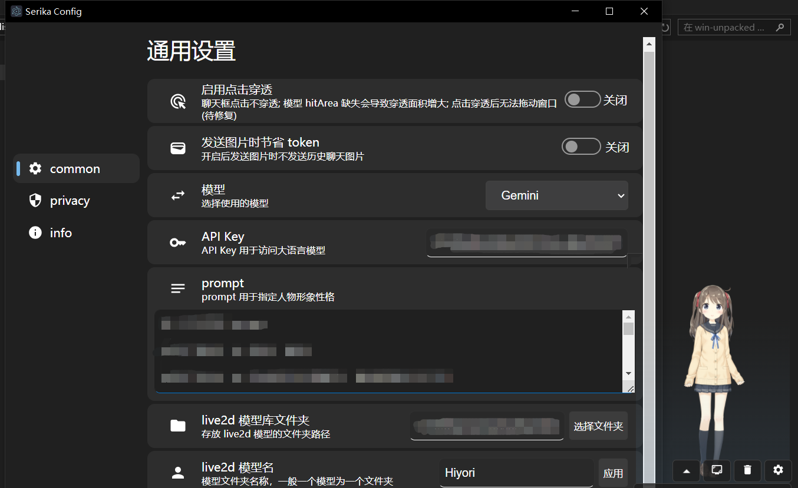

# Serika

使用 Electron + React 构建的桌面 AI 助手，使用 live2d 作为人物模型，支持 GPT, Gemini 作为聊天引擎



目前支持的特性：

- 点击穿透
- 截图，图像粘贴发送
- 语音合成 （需要启动 GPT-SoVits，运行 api.py）
- 彩蛋
  - 电棍语音合成 + 说的道理 live2d （使用模型 "一坨"） [模型作者链接](https://www.bilibili.com/video/BV1F94y1X7x6/)

## TODOs

- 用户体验
  - 语言模型切换，镜像链接设置
  - 接口错误处理
  - [x] 禁止多个设置窗口
  - 对话记录删除
  - ~~对话记录编辑~~
  - 语音重播功能修复
  - 窗口拖动功能修复
  - 窗口等比例缩放
  - 错误提示框
  - 任务栏 icon 
  - style 设置
- 功能
  - kimi api 支持
  - 代码执行功能
  - JSON格式回复
  - 人物动作表情对接
  - 程序自主截图功能
  - 代码结构优化
  - 大窗口长对话
  - [x] 设置页面
  - [x] 截图功能
  - [x] 图像功能
  - [x] 储存设置
  - [x] 主窗口 UI 优化
- 实验与探索
  - 聊天记录保存
  - MMD 模型支持
  - [x] l2d 模型路径设置
  - python 后端功能扩展


## Run the project

```bash
npm run dev
```

you need to input your openai api key in the setting before chatting with the bot.

## Project Setup

### Install

```bash
$ npm install
```

### Development

```bash
$ npm run dev
```

### Build

```bash
# For windows
$ npm run build:win

# For macOS
$ npm run build:mac

# For Linux
$ npm run build:linux
```

note: the repository is still in development, Framework will be changed into git submodule and live2d SDK will be removed soon.
